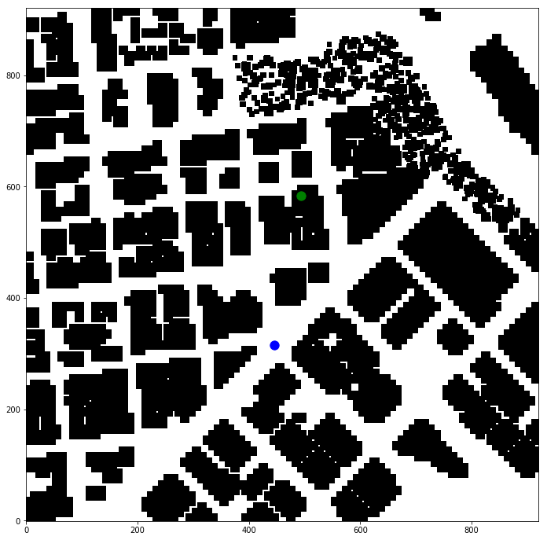
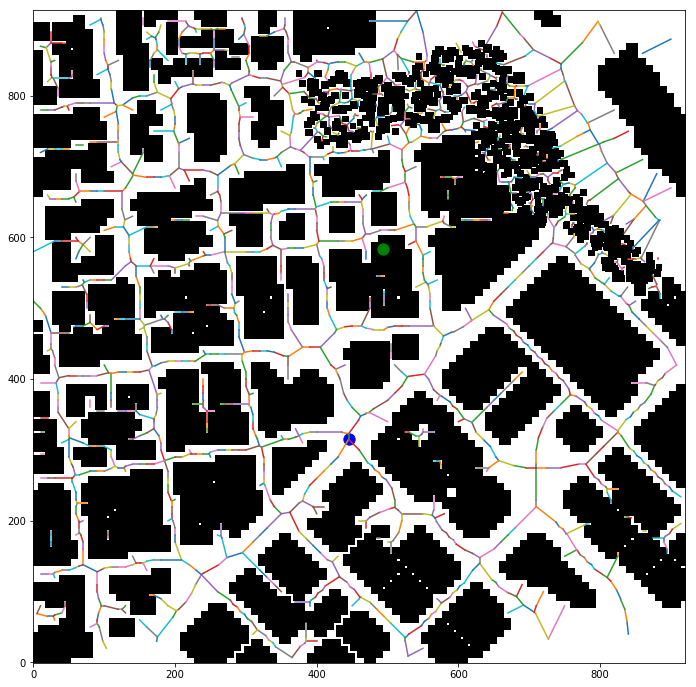
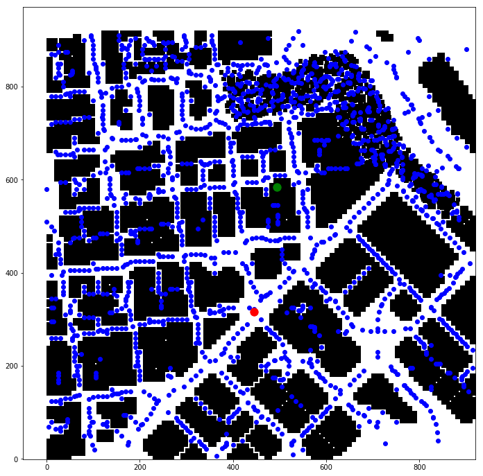
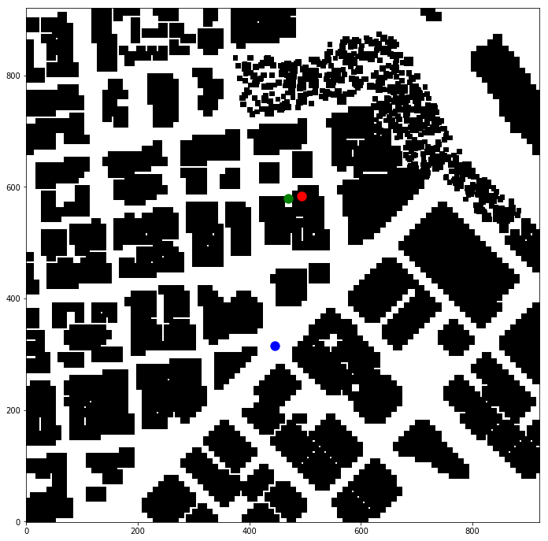
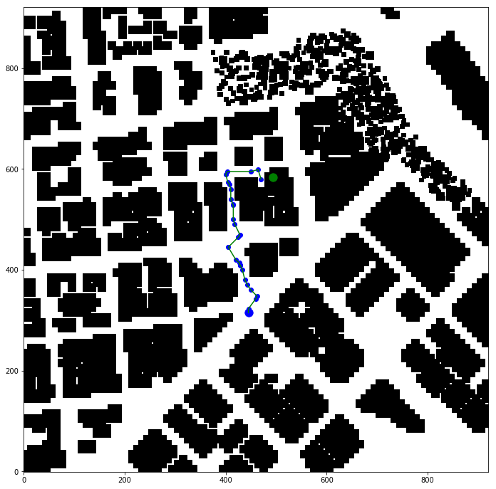
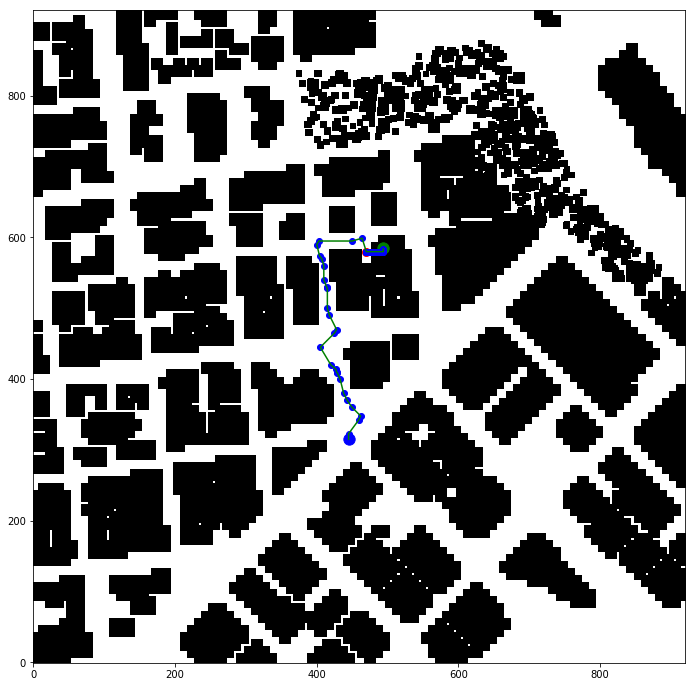

# FCND - 3D Motion Planning


[Video of motion planning in action](./misc/flight.mp4)

## Ruberic Points

### Ruberic Point #1 (Explain Starter Code)

#### State Diagram

For this project, I have used my own implementation carried forward from the Backyard Flyer project. The major difference is in the way state diagrams have been implemented. All of the state diagram code resides in one function `create_state_diagram`. Each node of the state diagram is specified using `state_diagram.add` and the definition includes:

- State Name   
- Callback function to check tansition   
- Result of the callback -> Transition Function   

e.g.

```
state_diagram.add(States.PLANNING, MsgID.STATE, 
                        lambda: self.plan_status,
                        PlanResult.PLAN_SUCCESS, self.takeoff_transition,
                        PlanResult.PLAN_FAILED, self.disarming_transition)
```

The state name is `States.PLANNING`, callback function is `MsgId.STATE`, callback function is a lambda that checks if a plan has been found (PlanResult.PLAN_SUCCESS) then it will transit to `takeoff_transition` otherwise it will go to `disarming_tansition`.

#### When is the plan created

When the drone is in the ARMED state, the code transits to PLANNING state (`planning_transition`). Following helper classes have been written to help in planning:

|Class Name  |Description|
|------------|-----------|
|GpsLocation |Represents Latitude, Longitude and Altitude (makes it easier not to confuse, lon and lat)|
|WorldMap |Loads data from colliders.csv, gets home location and then creates grid using Grid25 class|
|Grid25|A two dimensional np.array representation of the data in grid form. Each entry holds the height of the obstacle. Since grid25d is 0 based, a function `get_map_coord` has been provided to check obstacles based on world map based coordinate space (-ve values are allowed w.r.t to the home position)|
|Grid3d|A voxel based representation of the data|
|Planner|A*, Voronoi, KD Tree etc. are all used by the planner to plan a path from start to the goal state|

### Ruberic Point #2 

#### Reading Home Location

WorldMap::load (planning_utils.py) reads the first line of the data file and then uses regular expression to read the latitude and longitude

```
with open(self.filename) as f:
    line = f.readline()
    m = re.match('lat0\s(.*),\slon0\s(.*)', line)
```

#### Start Location

In the `planning_transition` function, current global position is read using `self.global_position`, which in turn reads (self._longitude, self._latitude, self._altitude), then it is converted to local position using `global_to_local`


#### Goal Location

I used google maps to pin point the center of the map and then chose a goal location that is on top of a building [Google Map Link](https://goo.gl/maps/vAw9Hj2sjo82)


## Overall Planning Process

The basic idea was to use a 2d graph using Voronoi at a constant flight height. In case the goal state lied on the graph it would have been sufficient but if the goal state does not lie on the 2d graph then an action based plan is employed to use different altitude to reach the goal state.

The following is a detailed list of steps:

- Planner (defined in planner.py) object is created 
- `Planner::load_map` loads the data and the initial home position
- Global home is set using `set_home_position`
- Start and goal locations in local coordinate space are created



- Planner is asked to generate a route using `plan_route` (Planner.py line # 84)
- Planner create a 2d path through the grid using drone's minimum height (5m)
- Using 2d grid map, `Voronoi` is used to create edges. Then `bresenham` is used to remove edges that collide with obstacles.



- Creates a Graph of **voronoi edges** using `ridge_vertices`. It uses euclidean distance as the weight of edges (planner.py line # 172). 
- A **KDTree of voronoi nodes** is created to help in finding closest goal / start states



- Since the final goal can be on top of a building, which would not be reachable through the Voronoi edges, a close by goal node is found and a path from start to the closeby goal is created. Once such a path has been found, ActionPlanner is used for creating an action based plan to reach from the closest goal to the actual goal on top of the building.

*Green is the closest* node to the goal



- **A-Star is run** on the graph to find a path from the start to the closest goal state in 2D grid
- Path returned is pruned using **colinearity checks**



- If the closest node to goal is > 0.1m away, **ActionPlanner** is called (defined in action_based_plan.py)
- Action planner tries to find a path from the **original goal** to the **closest goal**
- It uses **CubicAction**, which includes **changing altitude as part of action** in addition to changing the xy location
- If an action plan can be found, it is added at the end of the planned route from voronoi



- While following the plan, a deadband of 5 is used but while landing, specially on top of a building, this deadband is reduced. Therefore along with the plan, if the ActionPlanner was used, index of the node before the ActionPlanner nodes have been added is also returned. motion_planning.py Line # 285 (`waypoint_transition`) is the function that sets the dead band based on whether action plan is for landing sequence or not. Line # 320 (`is_close_to_current`) uses the defined dead_band to decide if waypoint has been reached. 

# Differences from Udacity Implementation

- Each node of the path also includes the cost of reaching the goal from that node
- Grid25 / Grid3d classes represent the grid
- Planner is a seperate class used for planning
- Wherever possible, instead of loops, direct np.array indices have been used

# Shortcomings

- Better culling alogrithm should be used to go through a more straighter route than the one followed.
- The landing spot needs to be checked to make sure drone has enough space to land. If not then choose a nearby bigger spot to land
- In case the drone starts off from a node that is not on the voronoi edges, the algorithm does not go to ActionPlanner directly and it gets stuck
- When the closest goal state is looked for, there are times that the closest node returned from the Voronoi does not have a path from start to that location.
- Close to obstacles, WAYPOINT_HIT_RAIDUS should be decreased as the drone gets off track near the obstacles
- My original plan was to create a receding horizon algorithm where by initial 2d path would have been computed and then a probabilistic roadmap would have been used. But due to shortage of time could not implement that.

#### Notes about colliders.csv

First line of colliders.csv holds the latitude and longitude with respect to which the rest of the file's coordinates have been recorded. 

Data read from the colliders.csv has the following columns:

| Column | Description|
|-|-|
|data[:, 0]| specifies the x (north) of the center of the obstacle|
|data[:, 1]| specifies the y (east) of the center of the obstacle|
|data[:, 2]| specifies the z coordinate of the center of the obstacle|
|data[:, 3]| is the half north side distance of the obstacle|
|data[:, 4]| is the half east side distance of the obstacle|
|data[:, 5]| is the half height of the obstacle|

Each data point is relative to the home location specified on the first line of the data file. In the given file home position is set to lat: 37.792480, lon: -122.397450
